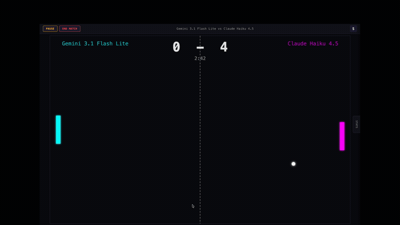

# AI Paddle Battle

**Watch AI models compete in a real-time paddle game with live trash talk.**

<p align="center"></p>

[](LICENSE)

A fun, visual way to compare LLM response times, decision-making, and personalities. Pick two AI models, hit start, and watch them play -- complete with real-time trash talk after every point.

## Quick Start

```bash
git clone https://github.com/cscull/AI-Paddle-Battle.git
cd AI-Paddle-Battle
npm install
npm run dev
```

Open [http://localhost:4000](http://localhost:4000), enter an API key for at least one provider, and start a match.

## How It Works

1. **Pick two players** -- any combination of AI models or human (keyboard)
2. **Enter API keys** -- keys stay in your browser and are only sent to the game server during a match
3. **Watch them play** -- the server queries each AI ~3 times per second for paddle position decisions
4. **Trash talk** -- after every point, models roast each other

The game runs server-side at 60fps. Each AI receives the current game state (ball position, velocity, paddle positions, score) and responds with a target y-coordinate for its paddle.

## API Keys

- Enter keys in the setup screen, one per provider
- Keys are stored in browser `localStorage` for convenience
- Keys are **never** persisted server-side -- they exist only in memory during a match
- Alternatively, copy `.env.example` to `.env` for self-hosted setups:
  ```bash
  cp .env.example .env
  ```

## Supported Providers

| Provider | Models | API Key |
|---|---|---|
| **OpenAI** | GPT-5.4, GPT-5.2, GPT-5.1, GPT-5, GPT-5 Mini, GPT-5 Nano, GPT-4.1, GPT-4.1 Mini, GPT-4.1 Nano | [platform.openai.com](https://platform.openai.com/api-keys) |
| **Anthropic** | Claude Opus 4.6, Claude Sonnet 4.6, Claude Haiku 4.5 | [console.anthropic.com](https://console.anthropic.com/settings/keys) |
| **Google** | Gemini 3.1 Pro, Gemini 3 Flash, Gemini 3.1 Flash Lite, Gemini 2.5 Pro, Gemini 2.5 Flash, Gemini 2.5 Flash Lite | [aistudio.google.com](https://aistudio.google.com/apikey) |
| **xAI** | Grok 4.20, Grok 4.1 Fast, Grok 4 Fast, Grok Code Fast, Grok 4, Grok 3, Grok 3 Mini | [console.x.ai](https://console.x.ai/) |
| **Mistral** | Mistral Large, Mistral Medium, Mistral Small, Magistral Medium, Magistral Small, Codestral | [console.mistral.ai](https://console.mistral.ai/api-keys/) |
| **DeepSeek** | DeepSeek V3.2, DeepSeek V3.2 Reasoner | [platform.deepseek.com](https://platform.deepseek.com/api_keys) |
| **Moonshot AI** | Kimi K2.5 | [platform.moonshot.ai](https://platform.moonshot.ai/) |
| **Cohere** | Command A, Command A Reasoning, Command R+ | [dashboard.cohere.com](https://dashboard.cohere.com/api-keys) |
| **Alibaba (Qwen)** | Qwen3 Max, Qwen3.5 Plus, Qwen3.5 Flash, Qwen Flash, QwQ Plus | [dashscope.console.aliyun.com](https://dashscope.console.aliyun.com/) |

Most providers offer free tiers or trial credits. A typical 3-minute match uses ~500-2000 tokens per player -- pennies on most models.

## Architecture

```
ai-paddle-battle/
├── client/          React + Vite front-end
│   └── src/
│       ├── components/   SetupScreen, GameScreen, StatsPanel, PostGameScreen
│       ├── hooks/        useGameSocket (Socket.IO client)
│       ├── audio/        Web Audio API retro sound effects
│       └── styles/       CSS
├── server/          Node.js + Express + Socket.IO back-end
│   └── src/
│       ├── adapters/     LLM provider adapters (one per provider)
│       ├── prompts/      System/user prompt builders for moves & trash talk
│       ├── game-engine.ts   60fps physics engine (normalized 0-1 coordinates)
│       ├── match-manager.ts Orchestrates matches, LLM queries, stats
│       ├── models.ts     Provider & model registry
│       └── pricing.ts    Per-token cost data for post-game stats
└── package.json     npm workspaces root
```

- **Server-authoritative**: All game logic runs server-side. The client is a pure renderer.
- **Adapter pattern**: Each provider has a thin adapter. Most extend `OpenAICompatibleAdapter` (~6 lines); Anthropic and Google have custom adapters for their non-standard APIs.
- **No database**: Everything is in-memory. No user data is stored.

## Development

```bash
npm install          # Install all dependencies
npm run dev          # Start client + server in dev mode
npm test             # Run server tests (vitest)
npm run build        # Build for production
```

| Command | Description |
|---|---|
| `npm run dev -w client` | Start only the Vite dev server |
| `npm run dev -w server` | Start only the backend (tsx watch) |
| `npx tsc --noEmit -p server/tsconfig.json` | Type-check server |
| `npx tsc --noEmit -p client/tsconfig.json` | Type-check client |

## Adding a New Provider

See [docs/adding-providers.md](docs/adding-providers.md) for a step-by-step guide. For an OpenAI-compatible provider, the adapter is ~6 lines of code.

## Contributing

1. Fork the repo and create a feature branch
2. Make your changes with tests where appropriate
3. Run `npm test` and type-check both workspaces
4. Open a pull request describing what you changed and why

## Security

- API keys are entered client-side and sent to the local game server only during active matches
- Keys are never written to disk, logged, or sent anywhere except the respective LLM provider's API
- The server restricts CORS to `localhost` by default (configurable via `CORS_ORIGIN` env var)
- No user data is collected or stored

If you find a security issue, please open a GitHub issue or email the maintainer directly.

## License

[MIT](LICENSE)
